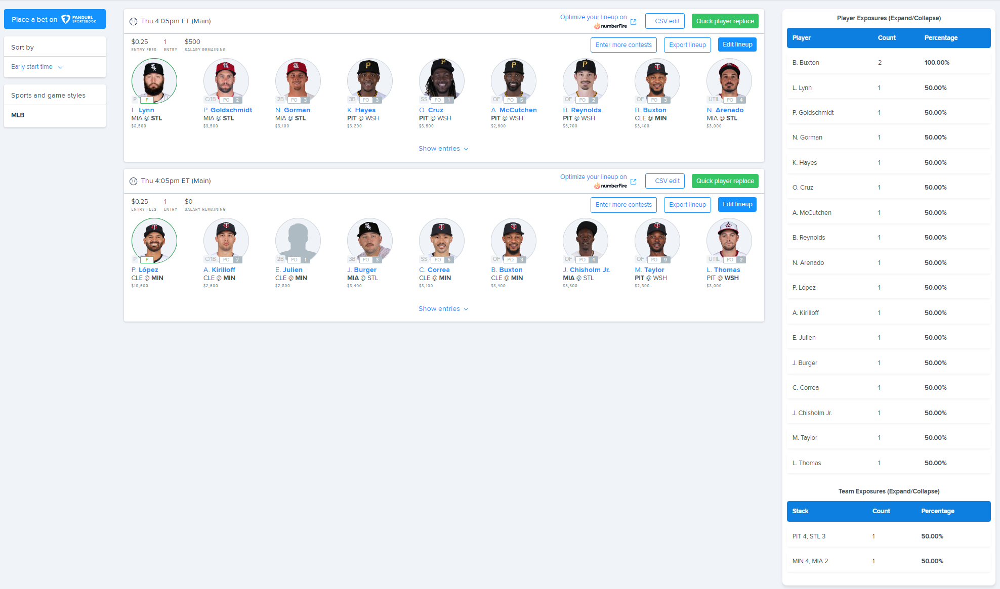

# FD-Exposure-Tool
A google chrome extension that displays an in-page overlay for FanDuel to show your upcoming lineups player exposures and team stack exposures.

## Example Overlay

## Installation
1. Download the latest release zip file from the `/zip` folder located in the root of the repository
2. Navigate to `chrome://extensions/` in yoru web browser and enable developer mode
3. Click "Load unpacked" and select the zip file you downloaded
4. The extension should now be installed and ready to use
5. Navigate to your FanDuel upcoming tab and within a few seconds the overlay should appear (the more lineups you have the longer it will take to load)

